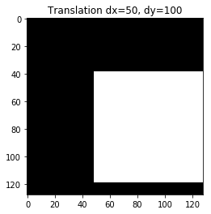
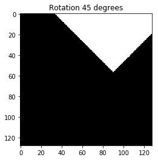
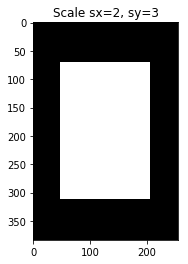
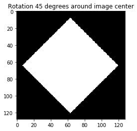

# Geometric Transformations

## Libraries


```python
import numpy as np # use numpy.zeros(), numpy.array()
import math # use math.pi, math.sqrt(), math.sin(), math.cos()
import cv2 as cv # read image cv.imread()
import matplotlib.pyplot as plt # plot image
```

## Image test


```python
image = cv.imread("input.png",0)
plt.imshow(image,cmap="gray")
plt.title("Original")
plt.show()
```


## Functions

### Translate

Considering that $(u,v)$ is the new image pixel and $(x,y)$ the old image pixel, translation is

$$
\left(\begin{array}{c}
x \\
y \\
1
\end{array}\right)=
\left(\begin{array}{ccc}
1 & 0 & -dx\\
0 & 1 & -dy\\
0 & 0 & 1
\end{array}\right)
\left(\begin{array}{c}
u\\
v\\
1
\end{array}\right)
$$


```python
def translate(img,dx,dy):
    row,col = img.shape[:2]

    # resulting image
    img_f = np.zeros(img.shape)

    # translate
    for u in range(col):
        for v in range(row):
            x = u - dx
            y = v - dy
            if(0<=x<col and 0<=y<row):
                img_f[v,u] = img[y,x]

    return img_f

img = translate(image,25,15)
plt.imshow(img,cmap="gray")
plt.title("Translation dx=50, dy=100")
plt.show()
```





### Rotate (in degrees)

Considering that $(u,v)$ is the new image pixel and $(x,y)$ the old image pixel, rotation is

$$
\left(\begin{array}{c}
x \\
y \\
1
\end{array}\right)=
\left(\begin{array}{ccc}
cos(\theta) & -sin(\theta) & 0\\
sin(\theta) & cos(\theta) & 0\\
0 & 0 & 1
\end{array}\right)
\left(\begin{array}{c}
u\\
v\\
1
\end{array}\right)
$$


```python
def rotate(img,ang):
    row,col = img.shape[:2]
    rad = ang*math.pi/180

    # resulting image
    img_f = np.zeros(img.shape)

    # rotate
    for u in range(col):
        for v in range(row):
            x = round(u*math.cos(rad)-v*math.sin(rad))
            y = round(u*math.sin(rad)+v*math.cos(rad))
            if(0<=x<col and 0<=y<row):
                img_f[v,u] = img[y,x]    
    return img_f

img = rotate(image,45)
plt.imshow(img,cmap="gray")
plt.title("Rotation 45 degrees")
plt.show()
```





### Scale

Considering that $(u,v)$ is the new image pixel and $(x,y)$ the old image pixel, scaling is

$$
\left(\begin{array}{c}
x \\
y \\
1
\end{array}\right)=
\left(\begin{array}{ccc}
1/S_x & 0 & 0\\
0 & 1/S_y & 0\\
0 & 0 & 1
\end{array}\right)
\left(\begin{array}{c}
u\\
v\\
1
\end{array}\right)
$$


```python
def scale(img,sx,sy):
    row,col = img.shape[:2]
    M,N = int(round(sy*row)), int(round(sx*col)) # new shape

    # resulting image
    if(img.ndim==3):
        img_f = np.zeros([M,N,3]) # for colored images
    else:
        img_f = np.zeros([M,N]) # for images in grayscale

    # scale
    for u in range(N):
        for v in range(M):
            x = round(u/sx)
            y = round(v/sy)
            if(0<=x<col and 0<=y<row):
                img_f[v,u] = img[y,x]

    return img_f

img = scale(image,2,3)
plt.imshow(img,cmap="gray")
plt.title("Scale sx=2, sy=3")
plt.show()
```





### Shear

Considering that $(u,v)$ is the new image pixel and $(x,y)$ the old image pixel, shearing is

$$
\left(\begin{array}{c}
x \\
y \\
1
\end{array}\right)=
\left(\begin{array}{ccc}
1 & -sh_x & 0\\
-sh_y & 1 & 0\\
0 & 0 & 1
\end{array}\right)
\left(\begin{array}{c}
u\\
v\\
1
\end{array}\right)
$$


```python
def shear(img,shx,shy):
    row,col = img.shape[:2]

    # resulting image
    img_f = np.zeros(img.shape)

    # shear
    for u in range(col):
        for v in range(row):
            x = round(u - v*shx)
            y = round(v - u*shy)
            if(0<=x<col and 0<=y<row):
                img_f[v,u] = img[y,x]

    return img_f

img = shear(image,0.75,-0.25)
plt.imshow(img,cmap="gray")
plt.title("Shearing shx=0.75, shy=-0.25")
plt.show()
```


### Affine Transformation

Considering that $(u,v)$ is the new image pixel and $(x,y)$ the old image pixel, affine transformation is

$$
\left(\begin{array}{c}
x \\
y \\
1
\end{array}\right)=
\left(\begin{array}{ccc}
t_{11} & t_{21} & t_{31}\\
t_{12} & t_{22} & t_{32}\\
0 & 0 & 1
\end{array}\right)
\left(\begin{array}{c}
u\\
v\\
1
\end{array}\right)
$$


```python
def affine(img,m):
    row,col = img.shape[:2]

    # resulting image
    img_f = np.zeros(img.shape)

    # affine transformation
    for u in range(col):
        for v in range(row):            
            x = int(round( m[0,0]*u + m[0,1]*v + m[0,2] ))
            y = int(round( m[1,0]*u + m[1,1]*v + m[1,2] ))
            if(0<=x<col and 0<=y<row):
                img_f[v,u] = img[y,x]

    return img_f

# rotate around image center
rad = 45*math.pi/180
row,col = image.shape[:2]
tx = (1-math.cos(rad))*row/2 - math.sin(rad)*col/2
ty = math.sin(rad)*row/2 + (1-math.cos(rad))*col/2

m = np.array(([math.cos(rad),-math.sin(rad),ty],
              [math.sin(rad), math.cos(rad),tx]))
img = affine(image, m)
plt.imshow(img, cmap="gray")
plt.title("Rotation 45 degrees around image center")
plt.show()


